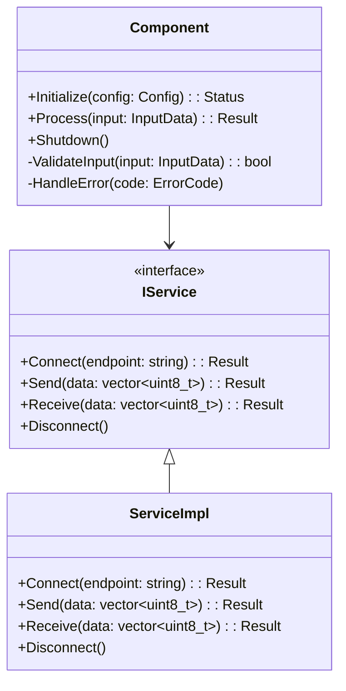
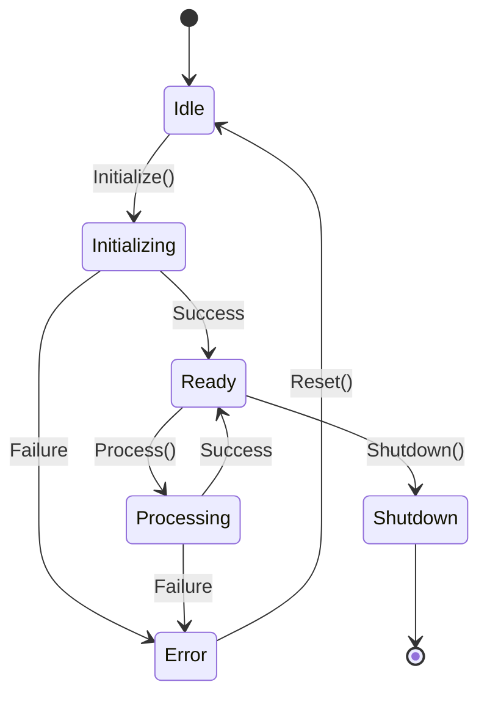

# {{COMPONENT_NAME}} - 组件详设（低层设计）

**AR单号**: {{AR_NUMBER}}  
**组件名称**: {{COMPONENT_NAME}}  
**所属需求**: {{FEATURE_NAME}}  
**版本**: v1.0  
**日期**: {{DATE}}  
**作者**: {{AUTHOR}}

---

## 1. 组件概述

### 1.1 组件职责

【描述该组件的核心职责和功能范围】

### 1.2 上下文关系

```mermaid
graph TB
    A[上游组件 A] --> B[{{COMPONENT_NAME}}]
    B --> C[下游组件 B]
    B --> D[下游组件 C]
```

### 1.3 设计约束

【描述该组件的设计约束：性能、资源、依赖等】

---

## 2. 类/结构体设计

### 2.1 类图



### 2.2 类职责说明

| 类名 | 职责 | 说明 |
|------|------|------|
| 【类名】 | 【职责】 | 【说明】 |
| 【类名】 | 【职责】 | 【说明】 |

### 2.3 类间关系

【描述类之间的继承、组合、依赖关系】

---

## 3. 详细接口设计

### 3.1 对外 API 接口

#### 接口 1: 【接口名称】

```cpp
/**
 * @brief 【接口功能描述】
 * @param 【参数名】 【参数描述】
 *        - 有效范围: 【范围】
 *        - 默认值: 【默认值】
 * @return 【返回值描述】
 *         - kOk: 【成功】
 *         - kInvalidParam: 【参数错误】
 *         - kNotInitialized: 【未初始化】
 * @thread_safety 【线程安全说明】
 * @example
 *   【调用示例】
 */
Result FunctionName(const InputData& input);
```

#### 接口 2: 【接口名称】

```cpp
/**
 * @brief 【接口功能描述】
 * @param 【参数名】 【参数描述】
 * @return 【返回值描述】
 */
Status AnotherFunction(const Config& config);
```

### 3.2 内部接口

【描述组件内部使用的接口】

### 3.3 回调/事件定义

```cpp
// 回调函数类型定义
using Callback = std::function<void(const Result&)>;

// 事件类型枚举
enum class EventType {
    kInitialized,
    kProcessing,
    kCompleted,
    kError
};
```

---

## 4. 数据结构设计

### 4.1 核心结构体/类

```cpp
/**
 * @brief 输入数据结构
 */
struct InputData {
    int32_t value;           ///< 输入值，范围 [MIN_VALUE, MAX_VALUE]
    std::string name;        ///< 名称，最大长度 256
    Callback callback;       ///< 回调函数，可为空
};

/**
 * @brief 结果数据结构
 */
struct Result {
    Status status;           ///< 操作状态
    int32_t output;          ///< 输出值
    std::string message;     ///< 状态信息
};
```

### 4.2 配置参数

```cpp
/**
 * @brief 组件配置
 */
struct Config {
    uint32_t timeout_ms = 5000;     ///< 超时时间，默认 5s
    uint32_t retry_count = 3;        ///< 重试次数，默认 3
    std::string endpoint;            ///< 服务端点
};
```

### 4.3 错误码定义

```cpp
/**
 * @brief 状态码枚举
 */
enum class Status {
    kOk = 0,                    ///< 成功
    kInvalidParam = -1,         ///< 参数错误
    kNotInitialized = -2,       ///< 未初始化
    kTimeout = -3,              ///< 超时
    kNetworkError = -4,         ///< 网络错误
    kInternalError = -5,        ///< 内部错误
};
```

---

## 5. 核心算法/逻辑

### 5.1 主流程伪代码

```cpp
Result Component::Process(const InputData& input) {
    // 1. 参数校验
    if (!ValidateInput(input)) {
        return Result{Status::kInvalidParam, 0};
    }
    
    // 2. 状态检查
    if (!initialized_) {
        return Result{Status::kNotInitialized, 0};
    }
    
    // 3. 执行业务逻辑
    auto result = ExecuteBusinessLogic(input);
    
    // 4. 触发回调
    if (input.callback) {
        input.callback(result);
    }
    
    return result;
}
```

### 5.2 状态机设计



**状态说明：**

| 状态 | 说明 | 允许的操作 |
|------|------|------------|
| Idle | 初始状态 | Initialize() |
| Initializing | 初始化中 | - |
| Ready | 就绪状态 | Process(), Shutdown() |
| Processing | 处理中 | - |
| Error | 错误状态 | Reset() |

### 5.3 错误处理策略

【描述错误处理策略：重试、降级、熔断等】

### 5.4 并发控制机制

```cpp
// 互斥锁保护共享状态
std::mutex mutex_;

// 原子状态
std::atomic<State> state_{State::kIdle};

// 使用示例
{
    std::lock_guard<std::mutex> lock(mutex_);
    // 访问共享状态
}
```

---

## 6. 测试场景清单

### 6.1 正常场景（TC001-TC099）

| 场景ID | 场景描述 | 预期结果 | 优先级 |
|--------|----------|----------|--------|
| TC001 | 【场景描述】 | 【预期结果】 | 高 |
| TC002 | 【场景描述】 | 【预期结果】 | 高 |

### 6.2 异常场景（TC101-TC199）

| 场景ID | 场景描述 | 预期结果 | 优先级 |
|--------|----------|----------|--------|
| TC101 | 【场景描述】 | 【预期结果】 | 高 |
| TC102 | 【场景描述】 | 【预期结果】 | 高 |

### 6.3 边界场景（TC201-TC299）

| 场景ID | 场景描述 | 预期结果 | 优先级 |
|--------|----------|----------|--------|
| TC201 | 【场景描述】 | 【预期结果】 | 中 |
| TC202 | 【场景描述】 | 【预期结果】 | 中 |

### 6.4 状态转换场景（TC301-TC399）

| 场景ID | 场景描述 | 预期结果 | 优先级 |
|--------|----------|----------|--------|
| TC301 | 【状态 A → 状态 B】 | 【预期结果】 | 高 |
| TC302 | 【状态 B → 状态 C】 | 【预期结果】 | 高 |


