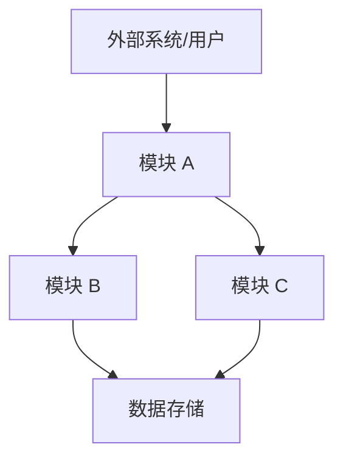
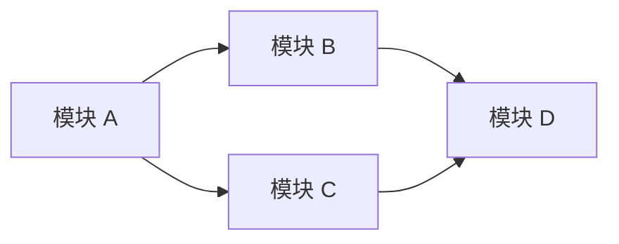
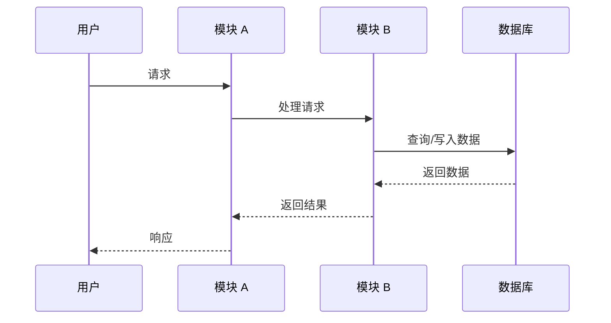

# {{FEATURE_NAME}} - SR/AR 需求级设计（低层设计）

**SR/AR单号**: {{REQUIREMENT_NUMBER}}  
**需求名称**: {{FEATURE_NAME}}  
**所属组件**: {{COMPONENT_NAME}}  
**版本**: v1.0  
**日期**: {{DATE}}  
**作者**: {{AUTHOR}}

---

## 1. 需求概述

### 1.1 背景与目标

【描述该需求的业务背景、解决的问题、预期目标】

### 1.2 范围定义

**包含范围：**
- 【功能点 1】
- 【功能点 2】
- 【功能点 3】

**不包含范围：**
- 【明确排除的功能】

### 1.3 术语定义

| 术语 | 定义 |
|------|------|
| 【术语 1】 | 【定义】 |
| 【术语 2】 | 【定义】 |

---

## 2. 系统架构设计

### 2.1 架构图

### 2.2 架构模式

【描述采用的架构模式：分层架构、微服务、事件驱动、插件化等】

### 2.3 技术选型

| 技术领域 | 选型 | 说明 |
|----------|------|------|
| 开发语言 | 【C++/Java/Python 等】 | 【选型理由】 |
| 框架 | 【框架名称】 | 【选型理由】 |
| 数据库 | 【数据库类型】 | 【选型理由】 |
| 消息队列 | 【MQ 类型】 | 【选型理由】 |

---

## 3. 模块划分

### 3.1 模块列表

| 模块名称 | 职责描述 | 优先级 |
|----------|----------|--------|
| 【模块 A】 | 【职责】 | 高 |
| 【模块 B】 | 【职责】 | 高 |
| 【模块 C】 | 【职责】 | 中 |

### 3.2 模块依赖关系

### 3.3 模块接口契约

#### 模块 A ↔ 模块 B

| 接口名称 | 方向 | 数据格式 | 协议 | 说明 |
|----------|------|----------|------|------|
| 【接口 1】 | A → B | 【JSON/Protobuf/等】 | 【HTTP/gRPC/等】 | 【说明】 |
| 【接口 2】 | B → A | 【数据格式】 | 【协议】 | 【说明】 |

---

## 4. 数据流设计

### 4.1 数据流图

### 4.2 数据存储设计

| 数据类型 | 存储方式 | 说明 |
|----------|----------|------|
| 【数据 1】 | 【MySQL/Redis/文件等】 | 【说明】 |
| 【数据 2】 | 【存储方式】 | 【说明】 |

### 4.3 数据转换规则

【描述数据在不同模块间的转换规则】

---

## 5. 非功能需求

### 5.1 性能要求

| 指标 | 目标值 | 说明 |
|------|--------|------|
| 响应时间 | 【如：< 200ms】 | 【说明】 |
| 吞吐量 | 【如：1000 TPS】 | 【说明】 |
| 并发用户数 | 【如：10000】 | 【说明】 |

### 5.2 可靠性要求

| 指标 | 目标值 | 说明 |
|------|--------|------|
| 可用性 | 【如：99.9%】 | 【说明】 |
| 故障恢复时间 | 【如：< 5分钟】 | 【说明】 |
| 数据持久化 | 【要求】 | 【说明】 |

### 5.3 安全性要求

- 【安全要求 1】
- 【安全要求 2】
- 【安全要求 3】

### 5.4 可扩展性设计

【描述系统的可扩展性设计思路】

---

## 6. 测试策略

### 6.1 测试层级

| 测试层级 | 覆盖范围 | 工具/框架 |
|----------|----------|-----------|
| 单元测试 | 【范围】 | 【工具】 |
| 集成测试 | 【范围】 | 【工具】 |
| 系统测试 | 【范围】 | 【工具】 |

### 6.2 关键测试场景

| 场景类型 | 场景描述 | 优先级 |
|----------|----------|--------|
| 【正常场景】 | 【描述】 | 高 |
| 【异常场景】 | 【描述】 | 高 |
| 【边界场景】 | 【描述】 | 中 |

---

## 7. 风险与应对

| 风险描述 | 影响 | 应对措施 |
|----------|------|----------|
| 【风险 1】 | 【高/中/低】 | 【措施】 |
| 【风险 2】 | 【高/中/低】 | 【措施】 |

---

## 8. 附录

### 8.1 参考资料

- 【文档/标准 1】
- 【文档/标准 2】

### 8.2 变更记录

| 版本 | 日期 | 作者 | 变更内容 |
|------|------|------|----------|
| v1.0 | {{DATE}} | {{AUTHOR}} | 初始版本 |
