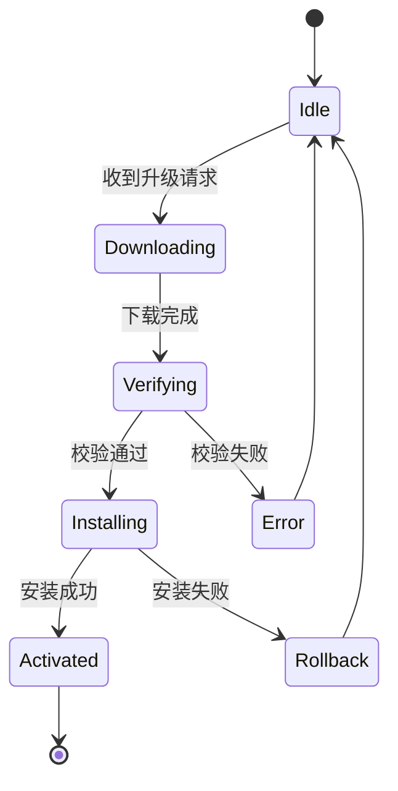
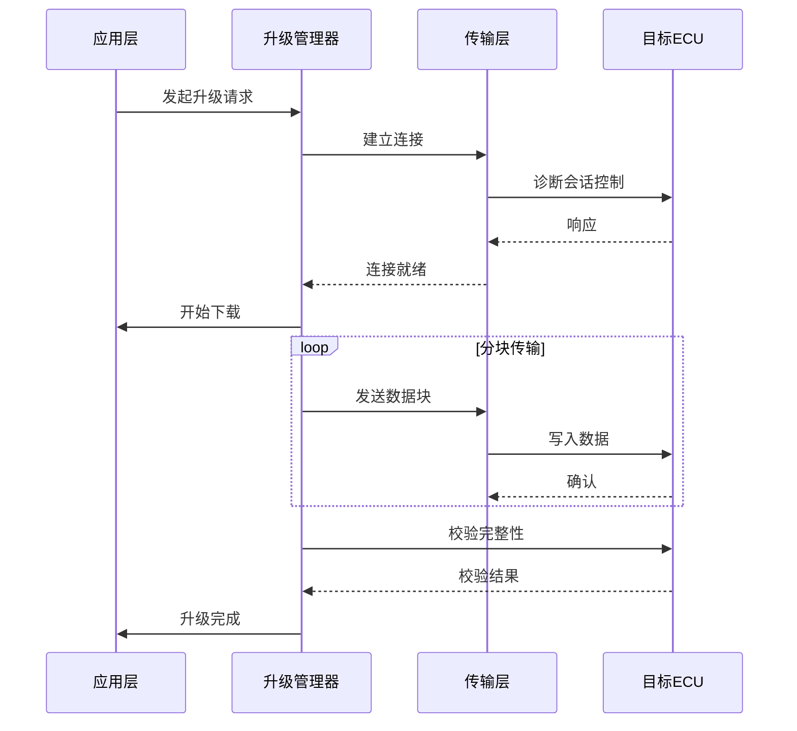

# {{FEATURE_NAME}} - 详细设计文档

## 文档信息

| 项目 | 内容 |
|------|------|
| SR单号 | {{SR_NUMBER}} |
| 需求名称 | {{FEATURE_NAME}} |
| 版本 | {{VERSION}} |
| 作者 | {{AUTHOR}} |
| 日期 | {{DATE}} |
| 评审状态 | 待评审 / 评审中 / 已通过 |

---

## 1. 需求概述

### 1.1 背景与目标
<!-- 描述该需求的业务背景、解决的问题、预期目标 -->

### 1.2 范围
<!-- 明确该功能涉及的范围，包括： -->
- **涉及模块**: 
- **影响范围**: 
- **接口变更**: 是 / 否

### 1.3 术语定义
| 术语 | 定义 |
|------|------|
| OTA | Over-The-Air，空中下载技术 |
| ECU | Electronic Control Unit，电子控制单元 |
| UDS | Unified Diagnostic Services，统一诊断服务 |
| FOTA | Firmware Over-The-Air，固件空中升级 |
| SOTA | Software Over-The-Air，软件空中升级 |

---

## 2. 功能规格

### 2.1 功能清单
| 序号 | 功能点 | 优先级 | 说明 |
|------|--------|--------|------|
| 1 | | 高/中/低 | |
| 2 | | 高/中/低 | |
| 3 | | 高/中/低 | |

### 2.2 状态机/流程图
<!-- 使用 Mermaid 或文字描述核心状态流转 -->


### 2.3 时序图
<!-- 关键交互时序 -->


---

## 3. 接口设计

### 3.1 对外接口（API）

#### 3.1.1 接口清单
| 接口名称 | 功能描述 | 调用方式 | 异步/同步 |
|----------|----------|----------|-----------|
| | | | |

#### 3.1.2 接口详细定义
```cpp
/**
 * @brief 启动软件升级流程
 * @param request 升级请求参数
 * @param callback 进度回调函数
 * @return 操作结果
 * @retval OK 启动成功
 * @retval ERROR_BUSY 升级正在进行中
 * @retval ERROR_INVALID_PARAM 参数无效
 */
UpgradeResult StartUpgrade(
    const UpgradeRequest& request,
    UpgradeProgressCallback callback);

/**
 * @brief 取消当前升级
 * @return 操作结果
 */
UpgradeResult CancelUpgrade();

/**
 * @brief 查询升级状态
 * @param status 输出当前状态
 * @return 操作结果
 */
UpgradeResult QueryUpgradeStatus(UpgradeStatus& status);
```

### 3.2 内部接口
| 接口名称 | 所属模块 | 功能描述 |
|----------|----------|----------|
| | | |

### 3.3 回调/事件
| 事件名称 | 触发条件 | 参数 |
|----------|----------|------|
| | | |

---

## 4. 数据结构设计

### 4.1 核心数据结构
```cpp
/**
 * @brief 升级请求结构体
 */
struct UpgradeRequest {
    std::string ecu_id;              ///< 目标ECU标识
    std::string software_version;    ///< 目标软件版本
    std::string package_path;        ///< 升级包路径
    uint32_t timeout_ms;             ///< 超时时间（毫秒）
    bool allow_rollback;             ///< 是否允许回滚
};

/**
 * @brief 升级状态枚举
 */
enum class UpgradeState {
    kIdle = 0,           ///< 空闲状态
    kDownloading,        ///< 下载中
    kVerifying,          ///< 校验中
    kInstalling,         ///< 安装中
    kActivating,         ///< 激活中
    kCompleted,          ///< 完成
    kFailed,             ///< 失败
    kRollingBack         ///< 回滚中
};

/**
 * @brief 升级状态信息
 */
struct UpgradeStatus {
    UpgradeState state;              ///< 当前状态
    uint32_t progress_percent;       ///< 进度百分比（0-100）
    std::string current_step;        ///< 当前步骤描述
    int32_t error_code;              ///< 错误码（失败时有效）
    std::string error_message;       ///< 错误信息
};
```

### 4.2 配置参数
| 参数名 | 类型 | 默认值 | 说明 |
|--------|------|--------|------|
| | | | |

---

## 5. 核心算法/逻辑

### 5.1 升级流程控制
```cpp
// 伪代码示例
UpgradeResult UpgradeManager::ProcessUpgrade() {
    // 1. 前置检查
    if (!CheckPreconditions()) {
        return UpgradeResult::kPreconditionFailed;
    }
    
    // 2. 下载阶段
    SetState(UpgradeState::kDownloading);
    if (auto result = DownloadPackage(); !result.ok()) {
        HandleError(result);
        return UpgradeResult::kDownloadFailed;
    }
    
    // 3. 校验阶段
    SetState(UpgradeState::kVerifying);
    if (!VerifyPackage()) {
        HandleError(VerifyError);
        return UpgradeResult::kVerifyFailed;
    }
    
    // 4. 安装阶段
    SetState(UpgradeState::kInstalling);
    if (!InstallPackage()) {
        TriggerRollback();
        return UpgradeResult::kInstallFailed;
    }
    
    // 5. 激活阶段
    SetState(UpgradeState::kActivating);
    ActivateNewVersion();
    
    SetState(UpgradeState::kCompleted);
    return UpgradeResult::kOk;
}
```

### 5.2 错误处理策略
| 错误场景 | 处理策略 | 是否可恢复 |
|----------|----------|------------|
| 下载超时 | 重试3次，仍失败则报错 | 是 |
| 校验失败 | 立即终止，上报错误 | 否 |
| 安装失败 | 触发回滚机制 | 是 |
| 通信中断 | 重连，失败则报错 | 视情况而定 |

### 5.3 并发控制
<!-- 描述多线程/多进程场景下的同步机制 -->
- 使用互斥锁保护共享状态
- 状态转换必须原子性
- 回调函数在独立线程执行

---

## 6. 安全与可靠性设计

### 6.1 功能安全（ASIL）
| 项目 | 等级/说明 |
|------|-----------|
| ASIL等级 | ASIL-A / ASIL-B / ASIL-C / ASIL-D / QM |
| 安全机制 | |
| 故障检测 | |
| 故障处理 | |

### 6.2 网络安全（Cyber Security）
| 项目 | 措施 |
|------|------|
| 升级包签名 | |
| 传输加密 | |
| 防重放攻击 | |
| 访问控制 | |

### 6.3 可靠性设计
- **断点续传**: 支持下载中断后从断点恢复
- **双备份机制**: 保留旧版本，支持回滚
- ** watchdog**: 防止升级过程卡死
- **超时机制**: 各阶段都有超时保护

---

## 7. 资源需求

### 7.1 内存需求
| 用途 | 大小 | 说明 |
|------|------|------|
| 代码段 | | |
| 数据段 | | |
| 堆内存 | | 峰值 |
| 栈内存 | | 每个线程 |

### 7.2 存储需求
| 用途 | 大小 | 说明 |
|------|------|------|
| 升级包缓存 | | |
| 备份分区 | | |
| 配置存储 | | |

### 7.3 CPU需求
- 峰值负载: 
- 平均负载: 

---

## 8. 测试场景清单

### 8.1 正常场景
| 场景ID | 场景描述 | 预期结果 |
|--------|----------|----------|
| TC001 | 正常升级流程 | 升级成功，版本更新 |
| TC002 | 断点续传 | 从中断处继续下载 |
| TC003 | 取消升级 | 安全终止，资源释放 |

### 8.2 异常场景
| 场景ID | 场景描述 | 预期结果 |
|--------|----------|----------|
| TC101 | 下载过程中网络断开 | 超时后报错，可重试 |
| TC102 | 升级包校验失败 | 终止升级，上报错误 |
| TC103 | 安装过程中ECU掉线 | 触发回滚 |
| TC104 | 存储空间不足 | 前置检查失败，提示清理 |
| TC105 | 升级包版本不匹配 | 校验失败，终止升级 |

### 8.3 边界场景
| 场景ID | 场景描述 | 预期结果 |
|--------|----------|----------|
| TC201 | 最小升级包 | 正常处理 |
| TC202 | 最大升级包 | 正常处理，进度准确 |
| TC203 | 并发升级请求 | 排队或拒绝 |
| TC204 | 极低电量升级 | 前置检查拒绝 |

---

## 9. 依赖与集成

### 9.1 外部依赖
| 依赖项 | 版本 | 用途 |
|--------|------|------|
| | | |

### 9.2 集成点
| 集成模块 | 集成方式 | 说明 |
|----------|----------|------|
| 诊断服务 | UDS协议 | 与ECU通信 |
| 存储管理 | 文件系统 | 升级包存储 |
| 网络管理 | TCP/IP | 下载升级包 |
| 电源管理 | 信号通知 | 电量检查 |

---

## 10. 风险与应对

| 风险ID | 风险描述 | 影响 | 应对措施 | 责任人 |
|--------|----------|------|----------|--------|
| R001 | 升级失败导致ECU变砖 | 高 | 双备份+回滚机制 | |
| R002 | 升级过程车辆断电 | 高 | 电源监控，低电量禁止升级 | |
| R003 | 升级包被篡改 | 高 | 数字签名验证 | |
| R004 | 升级时间过长 | 中 | 分块传输，断点续传 | |

---

## 11. 附录

### 11.1 参考资料
- AUTOSAR 规范
- UDS ISO 14229
- 项目需求文档（SR-{{SR_NUMBER}}）

### 11.2 变更记录
| 版本 | 日期 | 作者 | 变更内容 |
|------|------|------|----------|
| 1.0 | | | 初始版本 |

---

## 评审记录

| 评审轮次 | 评审日期 | 评审人 | 评审结论 | 备注 |
|----------|----------|--------|----------|------|
| | | | | |
