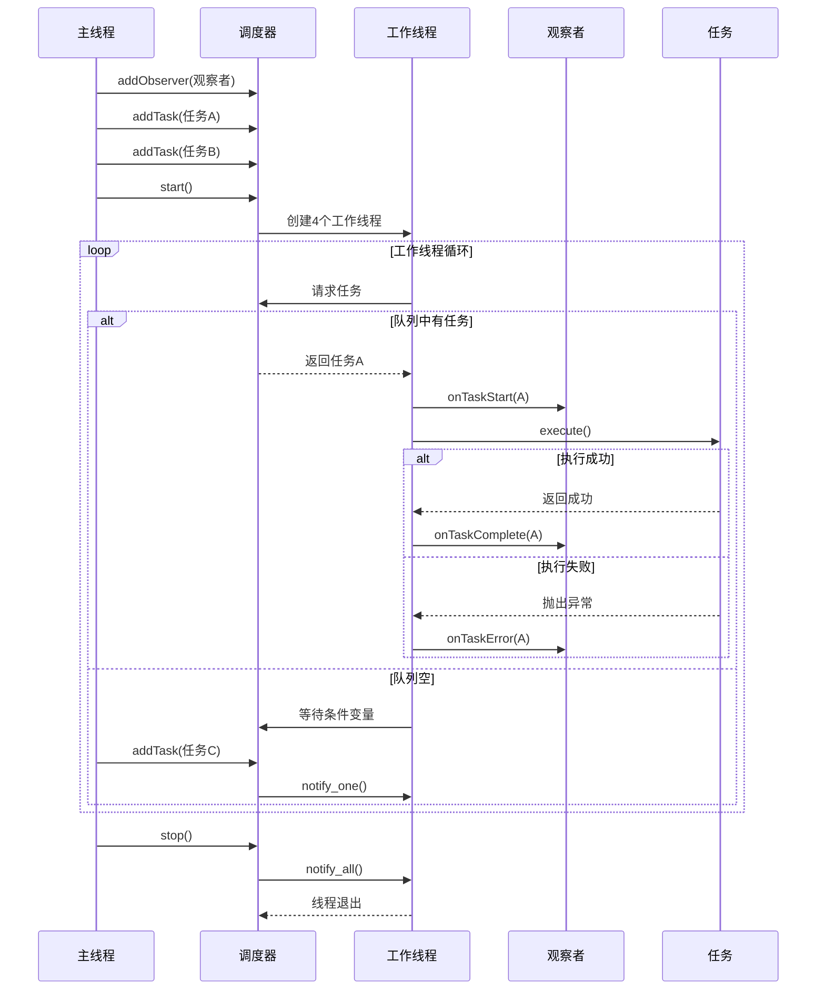
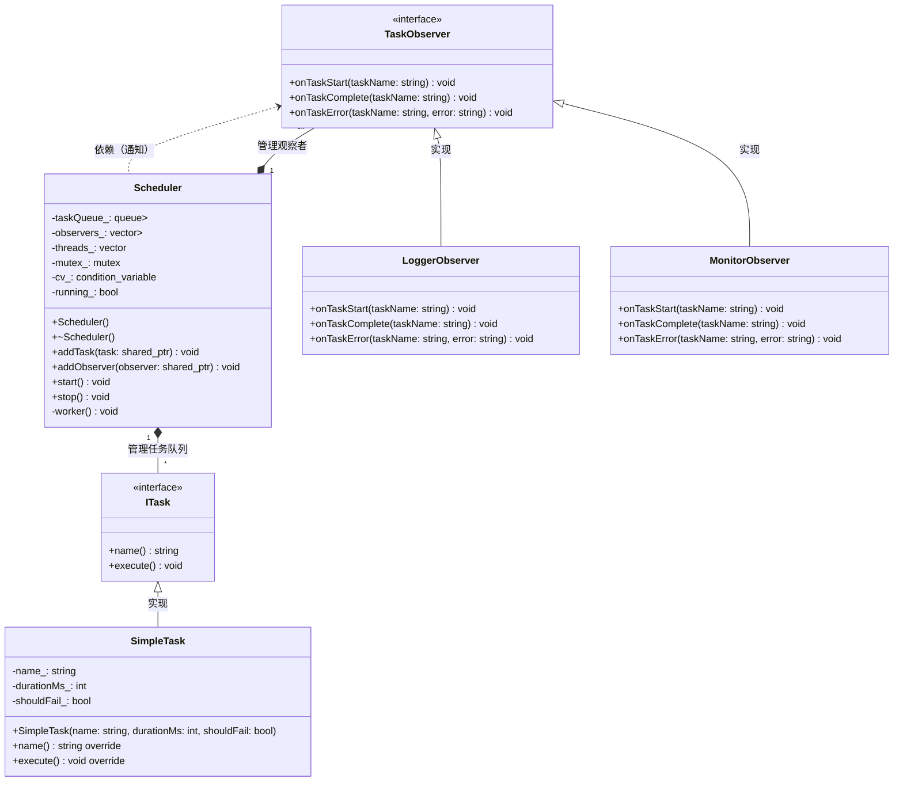

### 代码结构概述

代码工程实现了一个**多线程任务调度系统**，包含以下核心组件：

| 文件               | 核心功能               | 关键类/接口    |
| ------------------ | ---------------------- | -------------- |
| `ITask.h`          | 定义任务接口           | `ITask`        |
| `SimpleTask.h/cpp` | 具体任务实现           | `SimpleTask`   |
| `TaskObserver.h`   | 定义任务状态观察者接口 | `TaskObserver` |
| `Scheduler.h/cpp`  | 多线程任务调度器实现   | `Scheduler`    |

---

### 详细代码解析

#### 1. ITask.h - 任务接口
```cpp
#pragma once
#include <string>

class ITask {
public:
    virtual ~ITask() = default;
    virtual std::string name() const = 0;  // 获取任务名称
    virtual void execute() = 0;           // 执行任务
};
```
- **核心作用**：定义所有任务必须实现的接口
- **关键方法**：
  - `name()`：返回任务标识符
  - `execute()`：执行任务逻辑的入口

#### 2. SimpleTask.h/cpp - 具体任务实现
```cpp
// SimpleTask.h
class SimpleTask : public ITask {
public:
    SimpleTask(std::string name, int durationMs, bool shouldFail = false);
    std::string name() const override;
    void execute() override;

private:
    std::string name_;       // 任务名称
    int durationMs_;         // 模拟执行耗时(毫秒)
    bool shouldFail_;        // 是否故意失败
};

// SimpleTask.cpp
void SimpleTask::execute() {
    std::this_thread::sleep_for(std::chrono::milliseconds(durationMs_));
    if (shouldFail_) {
        throw std::runtime_error("Task failed intentionally: " + name_);
    }
    std::cout << "Executed " << name_ << " successfully.\n";
}
```
- **功能特点**：
  - 模拟延迟执行：通过`sleep_for`模拟任务处理耗时
  - 可控失败：当`shouldFail=true`时抛出异常
  - 线程安全：无共享状态，可安全并发

#### 3. TaskObserver.h - 观察者接口
```cpp
#pragma once
#include <string>

class TaskObserver {
public:
    virtual void onTaskStart(const std::string& taskName) = 0;       // 任务开始回调
    virtual void onTaskComplete(const std::string& taskName) = 0;    // 任务完成回调
    virtual void onTaskError(const std::string& taskName, const std::string& error) = 0;  // 任务失败回调
};
```
- **观察事件**：
  1. 任务开始执行
  2. 任务成功完成
  3. 任务执行出错

#### 4. Scheduler.h/cpp - 任务调度器
```cpp
// Scheduler核心成员
std::queue<std::shared_ptr<ITask>> taskQueue_;   // 任务队列
std::vector<std::shared_ptr<TaskObserver>> observers_;  // 观察者列表
std::vector<std::thread> threads_;               // 工作线程池
std::mutex mutex_;                               // 队列同步锁
std::condition_variable cv_;                     // 线程协调条件变量
bool running_;                                   // 调度器运行状态

// 工作线程逻辑
void Scheduler::worker() {
    while (true) {
        std::shared_ptr<ITask> task;
        {
            std::unique_lock<std::mutex> lock(mutex_);
            // 等待新任务或停止信号
            cv_.wait(lock, [this]() { 
                return !taskQueue_.empty() || !running_; 
            });
            
            if (!running_ && taskQueue_.empty()) return;
            
            task = taskQueue_.front();
            taskQueue_.pop();
        }

        try {
            // 通知观察者任务开始
            for (auto& obs : observers_) 
                obs->onTaskStart(task->name());
                
            task->execute();  // 执行任务
            
            // 通知观察者任务完成
            for (auto& obs : observers_) 
                obs->onTaskComplete(task->name());
        } catch (const std::exception& ex) {
            // 通知观察者任务失败
            for (auto& obs : observers_) 
                obs->onTaskError(task->name(), ex.what());
        }
    }
}
```
- **核心机制**：
  1. **生产者-消费者模型**：
     - 主线程通过`addTask()`生产任务
     - 工作线程通过`worker()`消费任务
  2. **线程同步**：
     - 使用`mutex`保护任务队列
     - 通过`condition_variable`实现线程等待/唤醒
  3. **观察者通知**：
     - 任务执行各阶段同步触发观察者回调
  4. **优雅停止**：
     - `stop()`设置`running_=false`并唤醒所有线程
     - 线程退出条件：运行标志false+任务队列空

---

### 系统工作流程



类图：




---

### 关键设计特点
1. **接口分离原则**
   - `ITask` 与 `TaskObserver` 解耦
   - 新增任务类型/观察者不影响调度器核心

2. **线程安全设计**
   - 所有共享资源（任务队列）通过互斥锁保护
   - 条件变量避免忙等待

3. **异常安全**
   - 任务异常被捕获并通知观察者
   - 不会导致工作线程崩溃

4. **资源管理**
   - 使用`shared_ptr`自动管理任务生命周期
   - 析构函数确保线程安全退出

---

### 使用示例
```cpp
// 1. 创建调度器
Scheduler scheduler;

// 2. 添加观察者（需实现TaskObserver接口）
scheduler.addObserver(std::make_shared<MyObserver>());

// 3. 添加任务
scheduler.addTask(std::make_shared<SimpleTask>("Task1", 100));
scheduler.addTask(std::make_shared<SimpleTask>("Task2", 200, true));

// 4. 启动调度器
scheduler.start();

// 5. 主线程继续其他工作...
std::this_thread::sleep_for(1s);

// 6. 停止调度器（等待所有任务完成）
scheduler.stop();
```

> **典型输出**：
> ```
> [Observer] Task1 started
> Executed Task1 successfully.
> [Observer] Task1 completed
> [Observer] Task2 started
> [Observer] Task2 failed: Task failed intentionally: Task2
> ```

这个设计非常适合需要后台任务处理的场景（如定时任务、批量数据处理等），通过观察者模式可以方便地集成日志、监控等功能。


### 注意点

\- 当任务数量少于线程数时，会有部分线程被唤醒并执行任务，剩下的线程继续休眠。

\- 当任务数量多于线程数时，任务会被放入队列，线程在执行完当前任务后会继续从队列中获取新任务（而不会休眠，因为队列不为空）。

\- 因此，`notify_one()`只是在有线程等待（休眠）时才有唤醒作用，如果没有线程等待，添加任务只是将任务放入队列，线程在完成当前任务后会主动检查队列并取新任务。


#### 观察者使用

```cpp
class Logger : public TaskObserver {
public:
    void onTaskStart(const string& name) override {
        cout << "[START][" << getTime() << "] " << name << endl;
    }
    void onTaskComplete(const string& name) override {
        cout << "[SUCCESS][" << getTime() << "] " << name << endl;
    }
    void onTaskError(const string& name, const string& error) override {
        cerr << "[ERROR][" << getTime() << "] " << name 
             << ": " << error << endl;
    }
};

// 使用
scheduler.addObserver(make_shared<Logger>());
```


# SchedulerTest.cpp 测试框架深度解析

## 测试用例详解

### 1. ExecutesTasksInParallel - 并行执行测试

**测试功能**：  
验证调度器能否正确处理并行任务执行，并正确发送任务状态通知

**前置条件**：
- 调度器实例已创建
- Mock观察者已注册
- 预期调用次数已设置

**执行步骤**：
1. 创建调度器实例
2. 创建Mock观察者
3. 设置观察者方法调用期望：
   - `onTaskStart` 调用3次
   - `onTaskComplete` 调用2次
   - `onTaskError` 调用1次
4. 注册观察者
5. 启动调度器
6. 添加3个任务：
   - Task1 (100ms, 成功)
   - Task2 (200ms, 故意失败)
   - Task3 (150ms, 成功)
7. 等待500ms确保任务完成
8. 停止调度器

**预期结果**：
- 所有3个任务都触发`onTaskStart`
- 2个成功任务触发`onTaskComplete`
- 1个失败任务触发`onTaskError`
- 没有多余的通知调用

**测试因子**：
| 因子     | 取值          | 测试目的         |
| -------- | ------------- | ---------------- |
| 任务数量 | 3             | 验证基本并行能力 |
| 任务类型 | 成功/失败     | 验证状态通知     |
| 任务时长 | 100/200/150ms | 验证时序处理     |
| 线程数   | 默认4         | 验证并发执行     |

**测试代码关键点**：
```cpp
TEST(SchedulerTest, ExecutesTasksInParallel) {
    Scheduler scheduler;
    auto mockObserver = std::make_shared<MockTaskObserver>();
    
    // 设置精确的预期调用次数
    EXPECT_CALL(*mockObserver, onTaskStart(_)).Times(Exactly(3));
    EXPECT_CALL(*mockObserver, onTaskComplete(_)).Times(Exactly(2));
    EXPECT_CALL(*mockObserver, onTaskError(_, _)).Times(Exactly(1));
    
    scheduler.addObserver(mockObserver);
    scheduler.start();
    
    // 添加混合任务（成功+失败）
    scheduler.addTask(std::make_shared<SimpleTask>("Task1", 100, false));
    scheduler.addTask(std::make_shared<SimpleTask>("Task2", 200, true)); // 故意失败
    scheduler.addTask(std::make_shared<SimpleTask>("Task3", 150, false));
    
    // 等待足够时间确保任务完成
    std::this_thread::sleep_for(std::chrono::milliseconds(500));
    scheduler.stop();
}
```

### 2. HandlesEmptyQueueGracefully - 空队列处理测试

**测试功能**：  
验证调度器在空队列情况下的稳定性和资源管理能力

**前置条件**：
- 调度器实例已创建
- 任务队列为空

**执行步骤**：
1. 创建调度器实例
2. 启动调度器
3. 等待100ms（模拟空队列状态）
4. 停止调度器

**预期结果**：
- 调度器正常启动和停止
- 工作线程在等待状态不消耗CPU
- 无任务时无崩溃或资源泄漏
- 停止时所有线程安全退出

**测试因子**：
| 因子     | 取值  | 测试目的       |
| -------- | ----- | -------------- |
| 队列状态 | 空    | 验证空闲处理   |
| 等待时间 | 100ms | 验证时间敏感性 |
| 线程状态 | 等待  | 验证条件变量   |

**测试代码关键点**：
```cpp
TEST(SchedulerTest, HandlesEmptyQueueGracefully) {
    Scheduler scheduler;
    scheduler.start();
    
    // 关键：验证空队列时的等待行为
    std::this_thread::sleep_for(std::chrono::milliseconds(100));
    
    scheduler.stop();
    
    // 隐式验证：无崩溃、无死锁、无资源泄漏
}
```

### 3. MultipleObserversReceiveNotifications - 多观察者通知测试

**测试功能**：  
验证调度器能否正确通知多个注册的观察者

**前置条件**：
- 调度器实例已创建
- 两个Mock观察者已注册
- 特定任务名称的预期已设置

**执行步骤**：
1. 创建调度器实例
2. 创建两个Mock观察者
3. 设置每个观察者对特定任务("TaskX")的启动通知预期
4. 注册两个观察者
5. 启动调度器
6. 添加任务"TaskX"(50ms, 成功)
7. 等待200ms确保任务完成
8. 停止调度器

**预期结果**：
- 两个观察者都收到`onTaskStart("TaskX")`调用
- 每个观察者收到1次调用
- 任务完成后所有通知完成

**测试因子**：
| 因子       | 取值        | 测试目的         |
| ---------- | ----------- | ---------------- |
| 观察者数量 | 2           | 验证多观察者支持 |
| 任务名称   | "TaskX"     | 验证参数传递     |
| 通知类型   | onTaskStart | 验证精确通知     |

**测试代码关键点**：
```cpp
TEST(SchedulerTest, MultipleObserversReceiveNotifications) {
    Scheduler scheduler;
    auto mockObserver1 = std::make_shared<MockTaskObserver>();
    auto mockObserver2 = std::make_shared<MockTaskObserver>();
    
    // 设置针对特定任务名的预期
    EXPECT_CALL(*mockObserver1, onTaskStart("TaskX")).Times(1);
    EXPECT_CALL(*mockObserver2, onTaskStart("TaskX")).Times(1);
    
    scheduler.addObserver(mockObserver1);
    scheduler.addObserver(mockObserver2);
    scheduler.start();
    
    scheduler.addTask(std::make_shared<SimpleTask>("TaskX", 50, false));
    
    // 等待时间 > 任务执行时间
    std::this_thread::sleep_for(std::chrono::milliseconds(200));
    scheduler.stop();
}
```

### 4. StressTestWithManyTasks - 压力测试

**测试功能**：  
验证调度器在高负载下的稳定性、性能和资源管理

**前置条件**：
- 调度器实例已创建
- Mock观察者已注册
- 最小调用次数预期已设置

**执行步骤**：
1. 创建调度器实例
2. 创建Mock观察者
3. 设置最小调用次数预期：
   - `onTaskStart` 至少50次
   - `onTaskComplete` 至少45次
   - `onTaskError` 至少5次
4. 注册观察者
5. 启动调度器
6. 添加50个任务：
   - 任务名: "StressTask0" 到 "StressTask49"
   - 每个任务执行10ms
   - 每第10个任务设置为失败(i % 10 == 0)
7. 等待2秒确保所有任务完成
8. 停止调度器

**预期结果**：
- 所有50个任务都启动
- 至少45个任务成功完成
- 至少5个任务失败
- 无任务丢失或重复
- 系统稳定无崩溃
- 资源使用合理（无内存泄漏，CPU使用正常）

**测试因子**：
| 因子     | 取值      | 测试目的       |
| -------- | --------- | -------------- |
| 任务数量 | 50        | 验证高负载     |
| 任务密度 | 连续添加  | 验证队列处理   |
| 失败率   | 10%(5/50) | 验证错误处理   |
| 执行时间 | 10ms/任务 | 验证短任务处理 |

**测试代码关键点**：
```cpp
TEST(SchedulerTest, StressTestWithManyTasks) {
    Scheduler scheduler;
    auto mockObserver = std::make_shared<MockTaskObserver>();
    
    // 设置最小调用次数预期
    EXPECT_CALL(*mockObserver, onTaskStart(_)).Times(AtLeast(50));
    EXPECT_CALL(*mockObserver, onTaskComplete(_)).Times(AtLeast(45));
    EXPECT_CALL(*mockObserver, onTaskError(_, _)).Times(AtLeast(5));
    
    scheduler.addObserver(mockObserver);
    scheduler.start();
    
    // 创建50个任务，其中10%故意失败
    for (int i = 0; i < 50; ++i) {
        bool shouldFail = (i % 10 == 0); // 每10个任务有1个失败
        scheduler.addTask(std::make_shared<SimpleTask>(
            "StressTask" + std::to_string(i), 10, shouldFail));
    }
    
    // 给予充足时间完成所有任务
    std::this_thread::sleep_for(std::chrono::seconds(2));
    scheduler.stop();
}
```

## MockTaskObserver 实现解析

```cpp
class MockTaskObserver : public TaskObserver {
public:
    // 使用MOCK_METHOD宏创建模拟方法
    MOCK_METHOD(void, onTaskStart, (const std::string&), (override));
    MOCK_METHOD(void, onTaskComplete, (const std::string&), (override));
    MOCK_METHOD(void, onTaskError, (const std::string&, const std::string&), (override));
};
```

### Google Mock 关键功能

| 方法          | 功能说明         | 示例                                    |
| ------------- | ---------------- | --------------------------------------- |
| `EXPECT_CALL` | 设置方法调用预期 | `EXPECT_CALL(observer, onTaskStart(_))` |
| `Times`       | 指定预期调用次数 | `.Times(Exactly(3))`                    |
| `Exactly`     | 精确调用次数     | `Exactly(3)`                            |
| `AtLeast`     | 最少调用次数     | `AtLeast(5)`                            |
| `_`           | 任意参数匹配     | `onTaskStart(_)`                        |
| 特定值        | 精确参数匹配     | `onTaskStart("TaskX")`                  |

### 测试有效性验证

| 测试用例                              | 验证的故障类型     |
| ------------------------------------- | ------------------ |
| ExecutesTasksInParallel               | 通知丢失、状态错误 |
| HandlesEmptyQueueGracefully           | 死锁、资源泄漏     |
| MultipleObserversReceiveNotifications | 观察者管理错误     |
| StressTestWithManyTasks               | 线程竞争、资源耗尽 |


